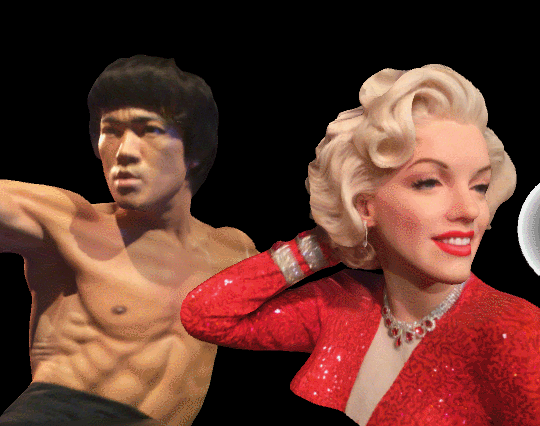
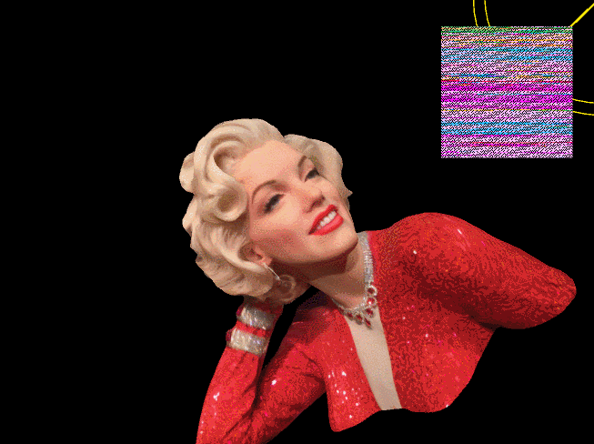
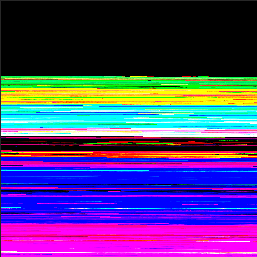
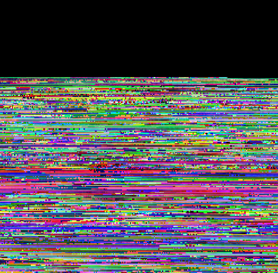

# ShaderGum
Unity3D GPU Sculpt &amp; Morph.  

## 3D models and textures by Tipatat Chennavasin  
It is 3D scan of wax figures from Madame Tussauds in Hollywood, Ca  
Bruce Lee by tipatat is licensed under CC Attribution  
Marylin Monroe by tipatat is licensed under CC Attribution  
[Tipatat's models on Skecthfab](https://sketchfab.com/tipatat)  

## Description
This is a Unity3D project with a set of scripts and shaders that manipulate vertex positions with textures and filters.  
Vertices from the mesh is listed and stored in a texture.  
A shader is processing position as a color: red, green and blue become x, y and z.  
A frame buffer is used to create persistence, to store a virtual space.  
The mesh uses a shader that gives the vertex positions from the generated texture.

## Experiment
This project was a good challenge to learn about processing float textures:  
How to map a vertex index to a texture coordinates.  
How to retrieve position from a texture.  
How to change the stored position with an image filter.  
With this features, you can imagine wonderful things, like animating blend shapes with textures.  
[This article on Gamasutra](http://www.gamasutra.com/blogs/TequilaWorks/20160620/275347/How_to_take_advantage_of_textures_in_the_vertex_shader.php)  by Tequila Works about this subject is great read, and is basically what gave me ideas.  
The key to store in a texture a float value that is beyond the color space (0..1) is the texture format.  
In Unity3D you have to create a [ARGBFloat render texture.](https://docs.unity3d.com/ScriptReference/RenderTextureFormat.ARGBFloat.html)

## Examples of applications
(Not in the current project, because too hacky lines of code)  
left: blending textures to animate smoothly vertices.  
right: implementation of Blender3D modeling soft selection trackball.

## Texture of vertex positions  
left: raw texture.  
right: same but with absolute digits of positions  

  

little elves moving color pigment to pixel places.  
(the green flash feels natural but it is because of gif compression)

### Leon - 30 / 06 / 2017 - GNU GPL 3 - Bisous
